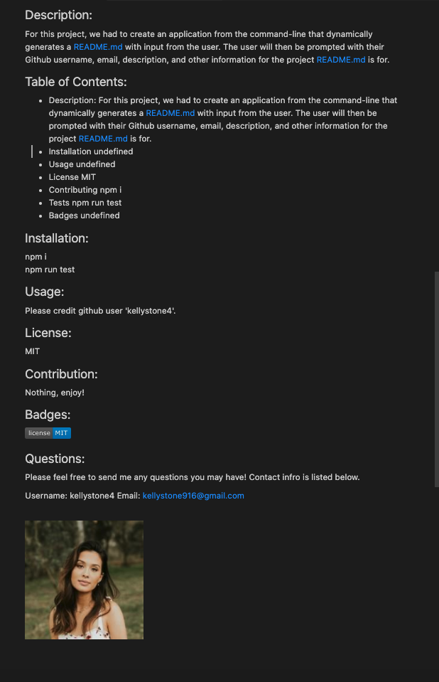

<u>

<center>

# Generate Markdown 

</u>

<u>

## Goal: Our goal for this assignment was to create an application from the command-line that dynamically generates a README.md with input from the user. The user will then be prompted with their Github username, email, description, and other information for the project README.md is for.

</u>
</center>

### 

<br>


Through this assignment, I focused alot on understanding the code. I first started out pseudo coding what I wanted the layout of the code to be. Then, I referenced class activities that we did to help me out with the assignment!

<br>


## Criteria:

Within this project, I included:

<center>

```
1. Command-line readme generator
2. User prompts
3. Github APIs
4. Description, email, title ect.
 ```

</center>


<br>

<u>

## Issues with the project:

</u>

<br>

- At first I tried using an api call with axios.get and was getting confused. 

    -  I solved this issue by using a different, more simple method to get the user image. Below is a snippet of the command-line generated README.md file, that includes the image.

  <br>

    
    
<br>

## Technologies Used:

- Visual Studio Code
- Gitlab
- Terminal
- Github

<br>

## Table of Contents:
1. Goal
2. Module Description
3. Criteria
4. Issues
5. Technologies Used
6. Table of Contents
7. Links
8. Deployed Link

<br>

## Links:

- [Link to Github](https://github.com/kellystone4/readMeGenerator1)
- [Link to LinkedIn](https://www.linkedin.com/in/kelly-a-stone/)

